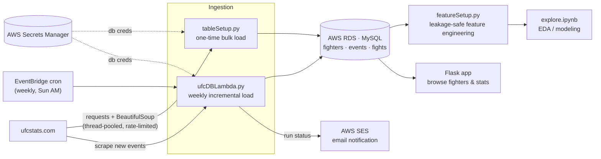
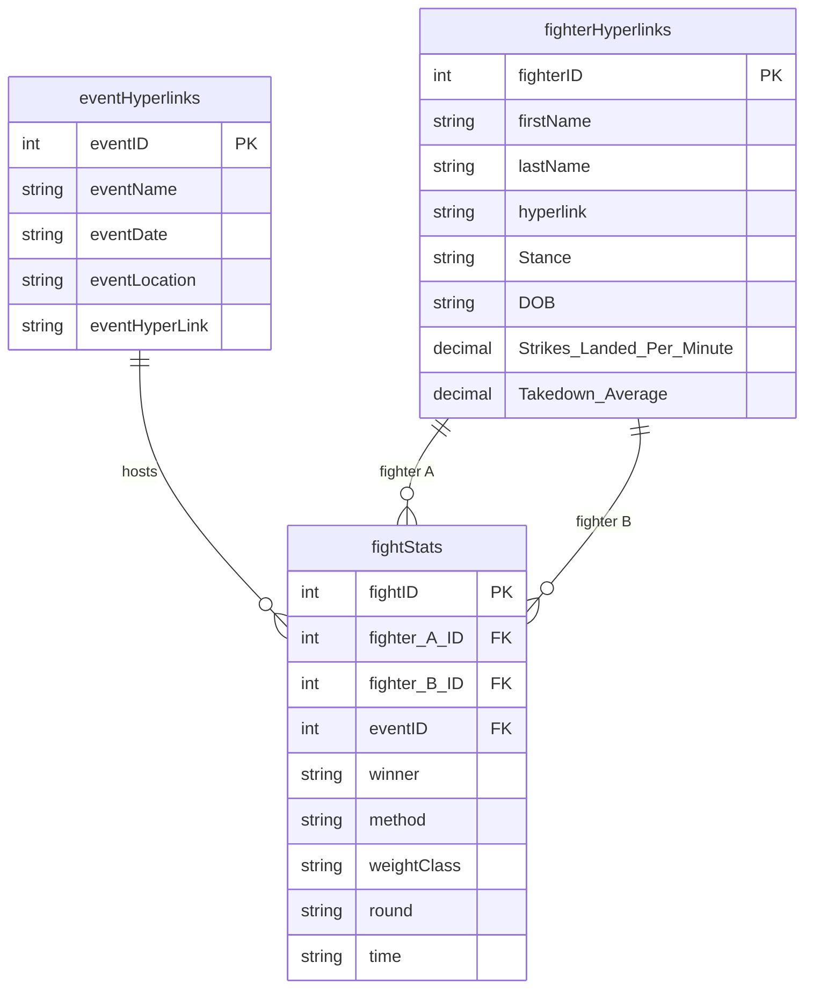

# UFC Stats — Data Engineering Pipeline

An end-to-end batch pipeline that scrapes [ufcstats.com](http://ufcstats.com), lands the data in a
relational store on AWS, keeps it current with a scheduled incremental load, and engineers
leakage-safe features for fight-outcome modeling. A lightweight Flask app sits on top for browsing.

The focus of this project is the **data engineering**: ingestion, modeling, incremental updates,
and feature engineering — not the web layer.

<p>
  
  
  
  
  
</p>

---

## Architecture



**Two ingestion paths feed one store:**

- **Bulk load** (`tableSetup.py`) — a one-time backfill that scrapes every fighter and every event
  since the unified-rules era (Sept 2000), then builds and populates all three tables from scratch.
- **Incremental load** (`ufcDBLambda.py`) — an AWS Lambda triggered weekly by EventBridge. It uses a
  **watermark** (the latest event date already stored) to detect and scrape only new events, updates
  fighter records, appends new fights, and emails a run summary via SES.

---

## Data model



| Table | Grain | Description |
|-------|-------|-------------|
| `fighterHyperlinks` | one row per fighter | Bio + career-level stats (reach, stance, strikes/min, takedown avg, …) and the source URL. |
| `eventHyperlinks` | one row per event | Event name, date, location, source URL. |
| `fightStats` | one row per bout | Per-fight box-score for both fighters, the winner, method/round/time, and FKs to the two fighters and the event. |

---

## Feature engineering

`featureEngineering/featureSetup.py` turns the raw box-score into model-ready, **per-bout** features.
The core design constraint is **no target leakage**: every career-to-date feature is computed using
only the fighter's *prior* bouts, never the one being predicted.

- SQL window functions use `ROWS BETWEEN UNBOUNDED PRECEDING AND 1 PRECEDING`.
- pandas cumulative features use `.cumsum().shift(1)`.

Features generated per fighter, as-of each bout:

| Feature | Meaning |
|---------|---------|
| `winPercentage` | Career win rate going into the fight |
| `numOfFights` | UFC experience (bouts to date) |
| `winStreak` | Active win streak |
| `averageFightTime` | Mean bout length (minutes) |
| `finishRate` | Share of wins by KO/TKO/submission |
| `strikeDifferential` | Cumulative sig. strikes landed ÷ absorbed |
| `takedownDifferential` | Cumulative takedowns landed ÷ absorbed |
| `averageControlTime` | Mean share of fight time in control |
| `Age`, `weightClass`, `stance` | Static / bout-level attributes |

The result is pivoted into one row per fight (`...A` vs `...B` columns) joined to the `winner`
label — ready to drop into a classifier.

---

## Repository layout

```
ufcStats/
├── ufcPipeline/                   # shared package — single source of truth
│   ├── scraping.py                # pure HTML parsers + network-backed scrapers
│   ├── db.py                      # MySQL connection helper
│   └── secretsManager.py          # AWS Secrets Manager credentials
├── SQL/
│   ├── sqlCreate/
│   │   └── tableSetup.py          # one-time bulk load: build + populate all 3 tables
│   └── sqlUpdate/
│       └── ufcDBLambda.py         # weekly AWS Lambda: watermark-based incremental load
├── featureEngineering/
│   ├── featureSetup.py            # leakage-safe feature engineering (SQL + pandas)
│   └── explore.ipynb              # EDA / model prototyping
├── flaskInt/                      # Flask web app (browse fighters & their stats)
│   ├── run.py
│   └── buildWeb/{routes,forms,__init__}.py + templates/
├── tests/                         # pytest suite + HTML fixtures for the parsers
├── pyproject.toml                 # dependency intent (core + dev/dbt/prod/legacy groups)
├── uv.lock                        # fully resolved graph, committed
└── pylintrc
```

---

## Tech stack

**Ingestion:** Python, `requests`, BeautifulSoup, `concurrent.futures` (thread-pooled scraping)
**Storage:** MySQL on AWS RDS
**Orchestration:** AWS Lambda + EventBridge (weekly cron)
**Secrets / notifications:** AWS Secrets Manager, AWS SES
**Transformation:** pandas, `pandasql`
**Serving:** Flask, Flask-WTF

---

## Running it locally

> Requires [uv](https://docs.astral.sh/uv/). It installs the pinned Python (3.12) itself, so
> nothing else is needed up front. The legacy AWS/MySQL path below additionally needs AWS
> credentials and a MySQL instance.

1. **Install dependencies**
   ```bash
   uv sync                    # core + dev + dbt, into .venv, from uv.lock
   ```
   `uv sync` creates the virtualenv, installs the exact locked versions, and puts
   `ufcPipeline` in it as an editable install — no separate `pip install -e .` step.
   Prefix commands with `uv run` (e.g. `uv run pytest`) and they execute inside that env.

   Optional groups:
   ```bash
   uv sync --group prod       # adds dbt-snowflake, for `dbt build --target prod`
   uv sync --group legacy     # adds Flask / MySQL / boto3 / pandasql for the frozen code below
   ```

2. **Provision credentials.** Create an AWS Secrets Manager secret named `ufcDBcred` (region
   `us-west-1`) holding `username`, `password`, `host`, and `dbInstanceIdentifier`. All scripts read
   DB credentials from here — nothing is hardcoded.

3. **Bulk load the database** (one time):
   ```bash
   cd SQL/sqlCreate && python tableSetup.py
   ```

4. **Engineer features:** open `featureEngineering/explore.ipynb`, or import `featureSetup` and call
   `set_up_features(fights_table, fighters_table)`.

5. **Run the web app:**
   ```bash
   cd flaskInt && python run.py     # http://127.0.0.1:5000
   ```

The incremental Lambda (`ufcDBLambda.py`) is deployed separately and runs on its weekly schedule.

---

## Tests

The HTML parsers are covered by unit tests that run against saved fixtures — no network
or database required:

```bash
uv run pytest
```

---

## Design decisions

- **Watermark-based incremental load** instead of re-scraping everything weekly — cheaper, faster,
  and a good citizen to the source site.
- **Secrets Manager** for DB credentials rather than env vars or hardcoded values.
- **Thread-pooled scraping with a 1s per-request delay** — parallel enough to backfill thousands of
  pages, polite enough not to hammer the source.
- **Leakage-safe feature windows** so the training set reflects only what was knowable before each
  bout.
- **A single scheduled Lambda over a full orchestrator** (Airflow/Dagster/Step Functions): the DAG is
  linear and runs weekly, so the operational overhead of an orchestrator isn't justified yet — see
  the roadmap for when that changes.

---

## Roadmap / known limitations

Honest about where this sits and where it's headed:

- **Reliability:** make the incremental load idempotent (unique keys + upserts) and advance the
  watermark only inside a transaction, so a mid-run failure can't drop events.
- **Schema:** normalize column types — several numeric stats are currently stored as strings.
- **Resilience:** add retry-with-backoff and per-item error isolation to scraping.
- **CI:** run the existing pytest suite in GitHub Actions and grow coverage beyond the parsers.
- **Infrastructure as code:** define the Lambda, schedule, and RDS via SAM/Terraform.
- **Data layering:** land raw scrapes immutably (bronze) before transforming (silver/gold) so the
  pipeline is reprocessable without re-scraping.
- **Modeling & UI:** train a baseline outcome model with a time-based backtest, and flesh out the
  Flask front end.
